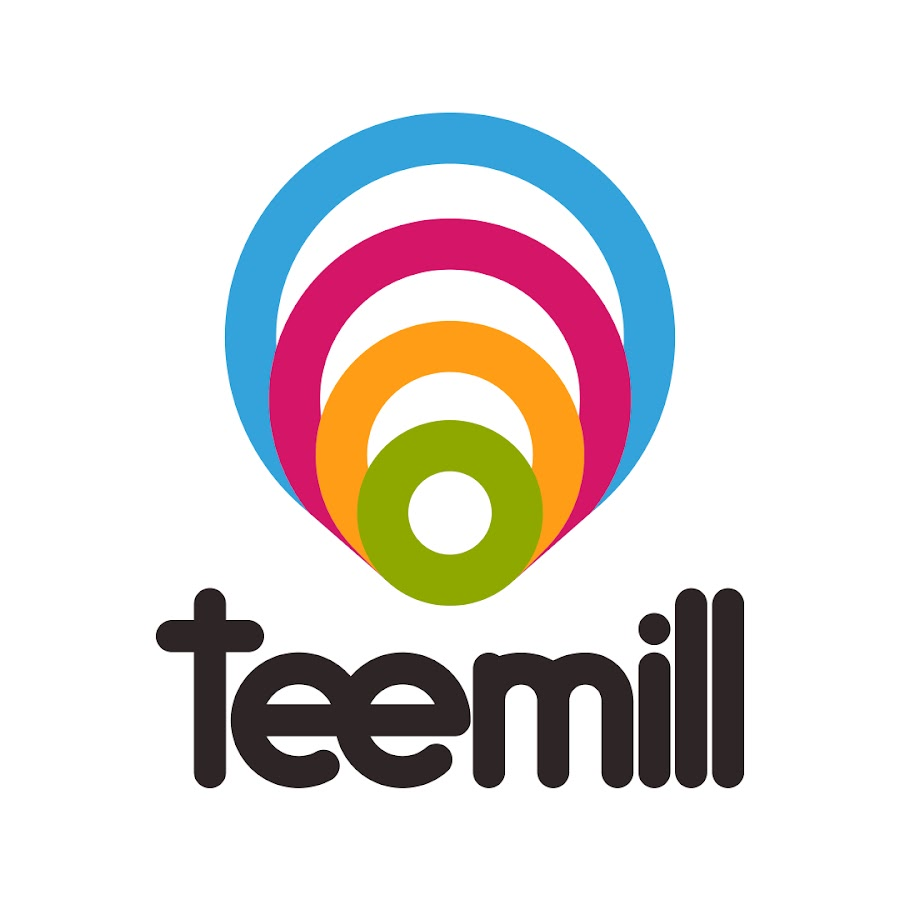

# Dreamai - AI Art Generator 🎨

Bring your ideas to life with the power of AI through text! Create stunning AI generated images by transforming your words into impressive works of art. With a wide variety of styles to choose from, you can customize your creations to your liking with unlimited freedom.

  

# Resources

- Kotlin
- SQLite
- Python
- Stable Diffusion v1.5
- Android Studio
- API Calls
- Firebase

# Screenshots

# About

No art skills are required! Dreamai's AI (artificial intelligence) art tool makes it easy to turn your imagination into reality from text.

## How does it work?

- Type your ideas
- Pick an art style or create your own
- Watch AI work its magic as it creates your design in seconds

## Discover your inner artist!

Explore your creative potential and bring your artistic ideas to life. Dreamai leverages cutting-edge AI models, such as Stable Diffusion, Midjourney, and DALL-E, to generate an endless stream of artwork based on your unique text prompt. The only limit is your imagination!

## Explore the community's creations.

Get inspiration from AI generated images from the community. Freely use their design or prompt, and modify them to your liking.

## Discover new styles or create your own.

Choose from an infinite variety of styles such as fantasy, anime, and cartoon, or combine your likings to create your unique style. Join our special styles events and earn rewards for your magnificent design.

## Share your stunning artwork!

Go viral by posting your masterpieces on social media or sharing them with your friends! Your creative creation can be used as an avatar profile icon, NFT, or new wallpaper.

## Transform your designs into reality!

Bring your unique designs into actual items! Feel the satisfaction of showing your unique creations to the world. Print your artwork on a range of products and colors, including t-shirts, hoodies, bags, and more.